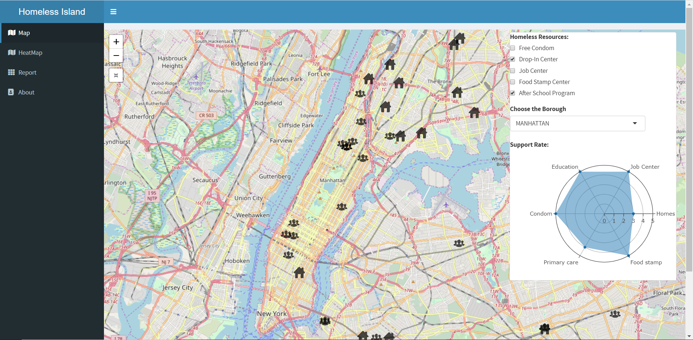

# [Homeless Support Guidance](https://chasel.shinyapps.io/homeless/)



## Applied Data Science @ Columbia Project 2: [App Link](https://chasel.shinyapps.io/homeless/)

### **Project summary**: 

+ For this project, we utilized datasets from NYC Open Data and Data.gov. The design of this project is to be presented to the New York City Department of Homeless Services. The application is to be used by sheltered and unsheltered homeless New Yorkers. With the respect to human dignity and human rights in heart, we hope the homeless population will find this application useful as they attempt to navigate the unique challenges that face them in our city.

+ The Map page is a resource guide map for the homeless population in New York City. It shows the location of resources: drop-in shelters, after-school programs, job centers, food stamp assistance and safe sex resources. There is also a functionality that shows the relative support rate per borough. 

+ The Heatmap page is a heat map of homeless population distribution across all five boroughs of New York City.

+ In our Report section, we utilized several datasets across different fields of interest from various open data web sources. The data was cleaned and prepared in R before being analyzed. The datasets includes: public facilities that are open to homeless population, homeless population distribution over time, health services for homeless, etc. As the datasets came from public resources, we believe the data to be as authentic and as accurate as possible. Interactive visualizations were made using shinyapp and plotly for R. 

Following [suggestions](http://nicercode.github.io/blog/2013-04-05-projects/) by [RICH FITZJOHN](http://nicercode.github.io/about/#Team) (@richfitz). This folder is orgarnized as follows.

```
proj/
├── app/
├── lib/
├── data/
├── doc/
└── output/
```

Please see each subfolder for a README file.

